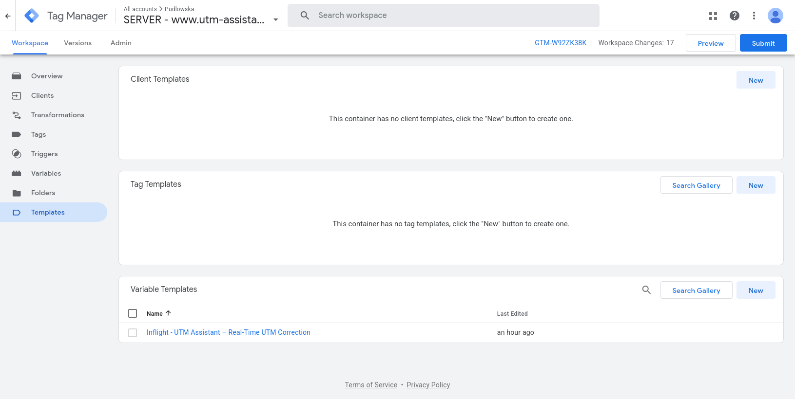
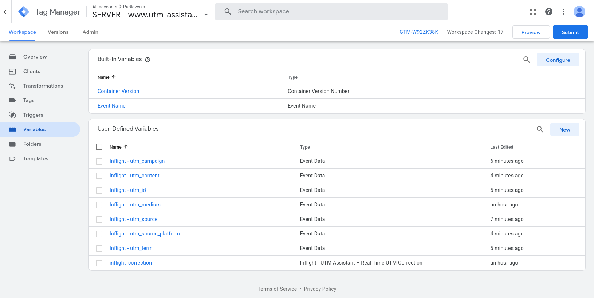
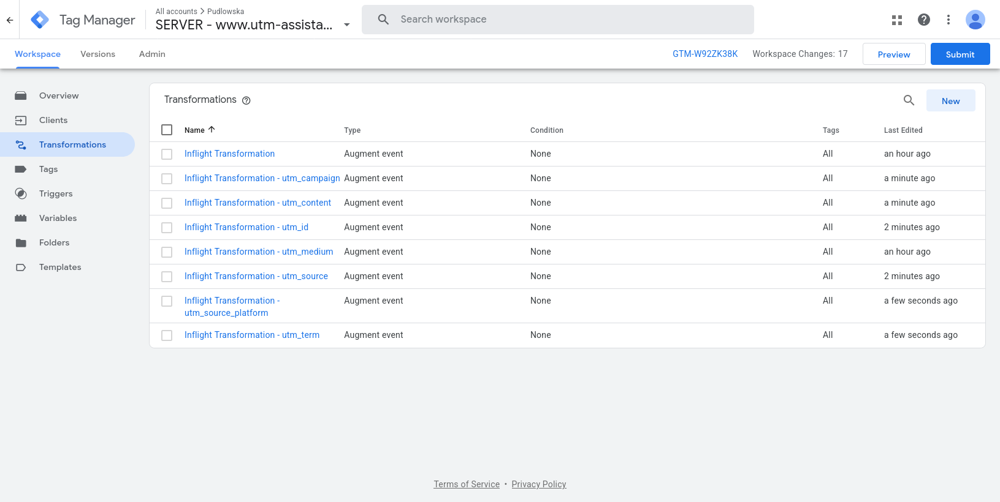
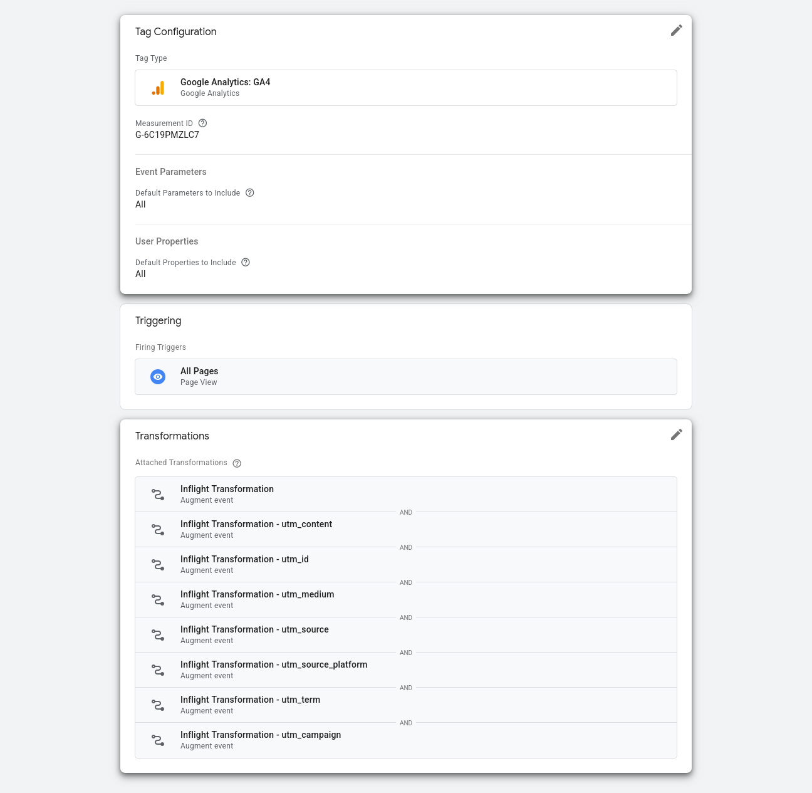

# Inflight — Real-Time UTM Correction (sGTM Custom Variable)

A Google Tag Manager **server-side Custom Variable** template. It reads the
incoming `utm_id` / `utm_source` / `utm_medium` / `utm_campaign` /
`utm_source_platform` / `utm_term` / `utm_content` event parameters — GA4's
full reported set per Google's own Analytics Help Center URL-builder
documentation, minus `utm_creative_format`/`utm_marketing_tactic`, which
GA4 accepts but doesn't report on — calls the Inflight ingestion API for the
corrected values, and resolves to a JSON object of them — one call per
event, corrected where possible, falling back to the original value
otherwise.

**Where it reads the UTM values from:** GA4 Client only populates these as
flat event-data fields on some hits (typically the one that first detects a
campaign, e.g. a session's first `page_view`) — a later `page_view` or
`user_engagement` in the same session often has none of them, even though
the real UTM link's parameters are still sitting in `page_location`'s query
string on every hit. This template checks the flat event-data value first
and falls back to parsing `page_location`'s query string when that's
absent, so correction isn't limited to whichever one hit GA4 happened to
forward the parameters on.

The template itself never writes event data (no
`setInEventData` equivalent for this template type — an earlier version
tried that and it does not work). Instead, routing the resolved values
into event data takes **one "fetch" Augment Event Transformation, plus one
built-in Event Data variable and one "apply" Augment Event Transformation
per `utm_*` key you want corrected** — see Installation below for exactly
why a single Transformation isn't enough. This is the exact setup
confirmed working end-to-end in a real production sGTM container (see the
screenshots throughout Installation below). Server-side only; no
client-side/web-container equivalent.

## Installation

The `.tpl` imports as a **Variable Template** (its declared `type` is
`MACRO`). It resolves to a JSON object, not a single value, so it's routed
into event data via a native **Augment Event Transformation** rather than
being referenced directly in a tag field.

### Step 1: Import the Variable Template from the Gallery

1. In your sGTM container, go to **Templates** in the left menu.
2. Under **Variable Templates**, click **Search Gallery**.
3. Search for **"Inflight - UTM Assistant – Real-Time UTM Correction"**.
4. Click the template and select **Add to workspace**.
5. Review the requested permissions (`read_event_data` — scoped to the 7
   `utm_*` keys plus `x-ga-measurement_id` and `page_location`,
   `send_http_request`, `access_template_storage`, `logging`) and click
   **Add**.

Confirm it now shows up under **Templates → Variable Templates**:



### Step 2: Instantiate the Variable

1. Go to **Variables** in the left menu.
2. Under **User-Defined Variables**, click **New**.
3. Open **Variable Configuration** and select the template under *Custom*.
4. Fill in API Key, Cloud Region, and the cache/timeout options (see the
   field table below) — see "Property resolution" below for how the
   property itself is determined.
5. Name the variable (e.g. `Inflight - Correction Data`) and **Save**.
   The screenshots throughout this guide name it `inflight_correction`
   instead (matching the event-data key it feeds in Step 3) — either
   works, it's just a naming choice.

### Step 3: Create the first Transformation — fetch the correction

**Why this can't be one step.** `{{Inflight - Correction Data}}` returns
a Promise on a cache miss (it calls `sendHttpGet()` — see "Data flow"
below). sGTM only awaits a Promise-returning variable when a field
consists of **that one `{{Variable}}` reference and nothing else**. Add
a trailing property path — `{{Inflight - Correction Data}}.utm_id` — and
the field switches to string-template mode instead: the variable gets
stringified unawaited (empty) and the literal trailing text is appended
as-is. Confirmed live, not just suspected from docs: every row silently
resolved to the literal string `.utm_id`, `.utm_source`, etc. — real GA4
hits showed these garbage strings as their UTM values, no error thrown.
There is also no server-side "Custom JavaScript" variable type to fall
back on for a hand-written extractor — sGTM removed that type entirely;
all custom logic there goes through a full Custom Template instead. So
the fix isn't a smarter Value field or a quick helper variable — it's
splitting the work into two Transformations, with a plain built-in
variable type doing the middle step synchronously.

1. **Transformations** → **New**.
2. Transformation type: **Augment event**.
3. Under **Parameters to Augment**, one row:

   | Parameter name | Value |
   |---|---|
   | `inflight_correction` | `{{Inflight - Correction Data}}` |

   The Value field must be **only** that bare reference — nothing typed
   before or after it. This is the one case that correctly awaits the
   Promise, writing the whole resolved object into
   `event_data.inflight_correction`.
4. Under **Advanced Settings**, set **Priority** to `10`. This matters:
   Priority lives here, higher numbers run first, and GTM's own default
   ordering only disambiguates *different* transformation types (Allow →
   Augment → Exclude) — since both Transformations in this setup are
   Augment Event, creation order does **not** decide which runs first.
   Without an explicit priority here, this step could evaluate *after*
   Step 5's Transformation, which would try to read
   `inflight_correction` before it exists.
5. Matching Conditions: leave it applying to all events (or narrow it).
   Affected Tags: **All tags** (or specific ones).
6. Name it (e.g. `Inflight - Fetch Correction`) and **Save**.

### Step 4: Create one Event Data variable per key

Now that the whole corrected object sits in event data under
`inflight_correction`, pull each key back out with the plain **built-in
Event Data variable type** — no custom code, no Template Editor, and
this read is synchronous (no Promise involved), so none of Step 3's
awaiting nuance applies here.

For each `utm_*` key you want corrected:

1. **Variables** → **User-Defined Variables** → **New**.
2. Variable type: **Event Data**.
3. **Key Path**: `inflight_correction.utm_id` (swap in the key name each
   time) — **plain text, no `{{ }}` braces**.
4. Name it `Inflight - utm_id` and **Save**.
5. Repeat for each of the seven keys you need (`utm_source`,
   `utm_medium`, `utm_campaign`, `utm_source_platform`, `utm_term`,
   `utm_content`). You don't need all seven — only create one for each
   field you actually want corrected.

Once you've created the main variable from Step 2 plus one Event Data
variable per key, **Variables → User-Defined Variables** should look like
this:



### Step 5: Create one Transformation per key — apply the correction

Unlike Step 3 (one Transformation, one row), this step is **one
Transformation per `utm_*` key**, each with a single row. This is the
exact structure confirmed working end-to-end in a real production
container (see the screenshot below) — it's not strictly required that
these be separate Transformation objects rather than several rows inside
one, but this is what's verified live, so it's what's documented here.

For each key you created an Event Data variable for in Step 4:

1. **Transformations** → **New** → **Augment event**.
2. Under **Parameters to Augment**, one row mapping that key to its Event
   Data variable — again, **the Value field must contain only the bare
   `{{Variable}}` reference**:

   | Parameter name | Value |
   |---|---|
   | `utm_id` | `{{Inflight - utm_id}}` |

   (swap in the matching key/variable each time — `utm_source` with
   `{{Inflight - utm_source}}`, and so on).
3. Under **Advanced Settings**, set **Priority** to `5` — anything lower
   than Step 3's `10` works; the only requirement is that this number is
   strictly lower than Step 3's, so `inflight_correction` already exists
   in event data by the time these run. All of them can share the same
   priority — there's no ordering dependency between them, since each
   only ever reads its own key.
4. Matching Conditions: same as Step 3 (all events, or narrower).
   Affected Tags: **All tags** (or the same specific tags as Step 3).
5. Name it `Inflight Transformation - utm_id` (swap in the key name) and
   **Save**.

A key that wasn't on the incoming event (and so isn't in the resolved
object) reads back as `undefined` from its Event Data variable; the
Transformation leaves that parameter alone rather than clearing it. Only
create a Transformation for the keys you actually created a variable for
in Step 4.

**Transformations** should now list the fetch Transformation from Step 3
plus one apply Transformation per key:



No per-tag Parameters/Fields to Set mapping is needed beyond these
Transformations — every tag downstream reads the corrected `utm_*`
values from event data automatically, the same way it would read any
other event parameter.

**Verify before publishing**: in Preview mode, click the affected tag and
check its **Transformations** panel shows all of them attached, with the
fetch Transformation from Step 3 evaluating before every per-key one:



Confirm "Outgoing HTTP Requests from Server" shows a real call to your
`{region}.cr.utm-assistant.ai/inflight` endpoint, and that the tag's own
Modified Event Data / Event data tab shows actual corrected values on
`utm_medium` etc. — not the whole `inflight_correction` object, not
`undefined`, and not a literal string like `.utm_id`. A timeout in the
Console panel (`sendHttpRequest: Request timed out`) on the very first
hit to a region is expected — see "Cold starts" further down — retry once
before assuming something's broken.

### Data flow

1. An incoming event reaches the Transformation Engine. **Fetch
   Correction** (Priority 10) evaluates `{{Inflight - Correction Data}}`.
2. `{{Inflight - Correction Data}}` reads `getEventData()` (falling back
   to `page_location` — see above), checks the cache (see "Caching"
   below), and on a cache miss calls the ingestion API via
   `sendHttpGet()`. Because the Transformation's Value field is that one
   bare reference and nothing else, **sGTM correctly awaits the Promise**,
   pausing every tag this Transformation affects until the request
   resolves or times out.
3. Fetch Correction writes the resolved object into
   `event_data.inflight_correction`. This is GTM's own native write
   mechanism for Augment Event — distinct from (and unaffected by) the
   `setInEventData` limitation mentioned above, which only applies to a
   template calling it directly from its own sandboxed JS.
4. Each Event Data variable from Step 4 synchronously reads its own key
   back out of `inflight_correction`.
5. Each per-key apply Transformation from Step 5 (Priority 5, runs after
   Fetch Correction) writes its Event Data variable's value into its
   matching top-level `utm_*` parameter — independently of the others,
   since none of them depend on each other's output.
6. Downstream tags fire and read the corrected (or, on any failure, the
   original) `utm_*` values straight from event data, with no per-tag
   configuration required.

### Known limitation: `page_location` is not rewritten

This template corrects the flat `utm_*` event-data keys — it does **not**
rewrite `page_location` itself. `page_location` holds the full incoming
URL as a plain string, and by the time our Transformations run, the GA4
Client has already parsed it (Client → Transformations → Tags is sGTM's
fixed order) — so a correction made here can't change what the Client
already extracted. It also isn't propagated back into `page_location`'s
own query string afterward, so the two diverge whenever a correction
actually changes a value.

Concretely, with a GA4 tag configured to forward all parameters (as in
the screenshot above), the hit that reaches Google contains **both**: the
corrected `utm_*` values as explicit event parameters, and the original,
uncorrected `page_location` string with the raw (possibly broken) values
still in its query string. In practice:
- **Session source/medium, Traffic acquisition, and other campaign
  reports** reflect the correction — these are driven by the explicit
  `utm_*` parameters on the hit, which are the corrected ones by the time
  the tag fires.
- **Landing page + query string, raw BigQuery exports of `page_location`,
  or any manual inspection of the hit's URL** still show the original,
  uncorrected value.

This is a known gap, not an oversight being silently carried forward. Fixing
it would mean reconstructing `page_location`'s query string with the
corrected values and writing it back via the same Augment Event mechanism
— tracked as a follow-up, not implemented here.

## Setup (per sGTM container)

| Field | Required / Default | Description |
|---|---|---|
| API Key | Required | Issued per account from the Inflight dashboard. Sent as the `X-Api-Key` header. |
| Cloud Region | Required | Must match the Cloud Run region this sGTM container runs in. See table below. |
| Cache corrections on this server instance | Optional — default: true | See "Caching" below. |
| Cache TTL (seconds) | Optional — default: 21600 (6h) | Lower if correction rulesets change often. |
| Request timeout (ms) | Optional — default: 400 | This call sits in the hot path before every tag fires — keep it tight. |

## Property resolution

The property is auto-detected per event, not typed into the template. The
GA4 Client populates `x-ga-measurement_id` in event data once it parses an
incoming hit; this template reads it via `getEventData('x-ga-measurement_id')`
and sends it as `property_id` to the ingestion API. On the backend, an
account admin links a given measurement ID to a heuristic ruleset under
their API key — see `utm-assistant-app`.

This means **one variable instance covers every GA4 property** routed
through a shared sGTM container — no per-property variable instances or
manual property ID entry needed.

There's no manual override field. If `x-ga-measurement_id` isn't available
on an event (no GA4 Client in the request path — e.g. non-GA4 traffic),
the variable fails open immediately without calling the ingestion API —
it resolves to the raw, uncorrected `utm_*` values instead. An earlier
version of this template had a "Property ID override" field for that
case and for manual testing; it was removed once the ingestion endpoint
started auto-provisioning a real property record for whatever
`property_id` it receives (see `utm-assistant-cr-inflight`) — a typed-in
test value would otherwise create a real, spurious property under the
account rather than being harmlessly ignored.

## Endpoint

```
GET https://{cloud-region}.cr.utm-assistant.ai/inflight?property_id=...&utm_id=...&utm_source=...&utm_medium=...&utm_campaign=...&utm_source_platform=...&utm_term=...&utm_content=...
X-Api-Key: {apiKey}
```

`property_id` is the auto-detected GA4 measurement ID (`G-XXXXXXXXXX`) —
see "Property resolution" above. It arrives as a plain string; the
ingestion API doesn't need to know it's specifically a GA4 measurement ID.

Expects a `200` JSON response with any subset of the five `utm_*` keys —
only keys present on the incoming event are included in the variable's
resolved object, and only the ones the response actually corrects get
overridden there; the rest fall back to their raw incoming value. Any
other status, a timeout, or an unparseable body leaves every key at its
raw value (fail open — this never blocks a tag or drops a parameter it
would otherwise have sent).

### Cold starts

The ingestion endpoint (`utm-assistant-cr-inflight`) runs with
`min_instance_count: 0` in every region. A cold start there takes
roughly 1-2 seconds, which blows past this template's default 400ms
**Request timeout (ms)** setting. Expect the *first* hit to a given
region (after any idle period) to time out and fail open — you'll see
`sendHttpRequest: Request timed out` in Preview's Console panel, and
`inflight_correction` will still contain the original, uncorrected UTM
values (fail-open, not an error). This is expected, not a bug: simply
retry the same hit — the container is warm for a while afterward, and a
second attempt within a minute or two should get a real response.

## Cloud Region mapping

The Cloud Region dropdown's `displayValue` uses the label style from the
original source list; the underlying `value` is the real Cloud Run region
code used in the endpoint subdomain. Cross-checked against Google's current
Cloud Run region list. Most resolve unambiguously (only one region exists
in that country); a handful didn't and were disambiguated — **verify these
against your actual GTM region picker before relying on them**.

The **Legacy `.a.run.app` code** column is the two-letter (or short)
region suffix Cloud Run puts in a service's default URL under its older
URL scheme (e.g. `...-uc.a.run.app`) — see Method 4 below. Google does
not publish this mapping (its own docs explicitly say not to parse this
identifier — see Method 4's caveat); every value below was verified
directly against `utm-assistant-cr-inflight`'s own live Cloud Run
deployment across all 19 of these regions (`gcloud run services list`),
not copied from a third-party table.

### Americas

| Display label | Region code | Legacy `.a.run.app` code | Note |
|---|---|---|---|
| CA East (Canada) | `northamerica-northeast1` | `nn` | ⚠ Defaulted to Montreal over Toronto (`northamerica-northeast2`). |
| US Center (Iowa) | `us-central1` | `uc` | |
| US East (South Carolina) | `us-east1` | `ue` | |
| US West (Oregon) | `us-west1` | `uw` | |
| SA East (Brazil) | `southamerica-east1` | `rj` | |
| SA West (Chile) | `southamerica-west1` | `tl` | |

### Europe

| Display label | Region code | Legacy `.a.run.app` code | Note |
|---|---|---|---|
| EU West (England) | `europe-west2` | `nw` | ⚠ Source list said "EU North (England)" — no Cloud Run region matches north+England. London is `europe-west2`; relabeled. |
| EU West (Belgium) | `europe-west1` | `ew` | |
| EU West (Germany) | `europe-west3` | `ey` | ⚠ Source list said "EU Center (Germany)" — GCP's actual central-Europe region is Warsaw, not Germany. Frankfurt is `europe-west3`; relabeled. |
| EU North (Finland) | `europe-north1` | `lz` | |
| EU North (Netherlands) | `europe-west4` | `ez` | |
| EU East (Poland) | `europe-central2` | `lm` | |
| EU Center (France) | `europe-west9` | `od` | |
| EU South (Italy) | `europe-west8` | `oc` | ⚠ Defaulted to Milan over Turin (`europe-west12`). |

### Middle East

| Display label | Region code | Legacy `.a.run.app` code | Note |
|---|---|---|---|
| ME Center (Qatar) | `me-central1` | `ww` | |

### Asia-Pacific

| Display label | Region code | Legacy `.a.run.app` code | Note |
|---|---|---|---|
| JP Center (Japan) | `asia-northeast1` | `an` | ⚠ Defaulted to Tokyo over Osaka (`asia-northeast2`) — no region is officially "center". |
| AP South (India) | `asia-south1` | `el` | ⚠ Defaulted to Mumbai over Delhi (`asia-south2`). |
| AP East (Singapore) | `asia-southeast1` | `as` | |
| AU East (Australia) | `australia-southeast1` | `ts` | ⚠ Defaulted to Sydney over Melbourne (`australia-southeast2`). |

If any ⚠ default is wrong, it's a one-line edit to the `selectItems` array
in `template.tpl`.

## Finding your sGTM container's region

How you check the region depends on whether your tagging server was set up
via automatic or manual provisioning (Cloud Run / App Engine).

### Method 1: Google Cloud Console (Cloud Run / App Engine)

If you manage your own GCP infrastructure or used standard setup:

1. Log into the [Google Cloud Console](https://console.cloud.google.com/).
2. Select the GCP project associated with your sGTM deployment.
3. Open **Cloud Run** from the main menu.
4. Look at the **Region** column next to your sGTM services (e.g.
   `us-central1`, `europe-west1`, `asia-northeast1`).

(If your container predates late 2023 and uses App Engine instead of Cloud
Run, go to **App Engine → Settings** to see the region instead.)

### Method 2: Check the Cloud Run URL

Every default Cloud Run service endpoint contains the deployment region
directly inside its domain name:

```
https://gtm-xxxxxx-xxxx.<region>.run.app
```

Example: `https://gtm-abc123-xyz.europe-west1.run.app` → region is
`europe-west1`.

### Method 3: Inspect network response headers (quick check)

If your sGTM container is attached to a custom domain (e.g.
`metrics.yourdomain.com`):

1. Open your website in a browser.
2. Open Developer Tools (F12) → **Network** tab.
3. Reload the page and select an incoming request sent to your sGTM domain.
4. Check the response headers for Google Cloud routing headers — look for
   `x-cloud-trace-context` or similar Google infrastructure headers, which
   often include datacenter location codes (e.g. `fra` for Frankfurt, `iad`
   for Iowa).

### Method 4: Decode the legacy Cloud Run default URL

If your container is on Cloud Run's **Tagging Server** page it usually
shows a **Default URL** even when a custom domain is also configured.
Two different URL shapes exist, and only one of them can be decoded by
eye:

- **Newer, deterministic format** — `SERVICE-PROJECT_NUMBER.REGION.run.app`
  (e.g. `gtm-abc123-456789012345.europe-west1.run.app`). The region is
  already spelled out in full — this is just Method 2 above, no lookup
  needed.
- **Older, non-deterministic format** — `SERVICE-HASH-XX.a.run.app`,
  where `XX` is a short region suffix (e.g.
  `server-side-tagging-hi6gn6gema-uc.a.run.app` → `uc`). This is what
  most existing sGTM containers still show.

For the older format, look up the `XX` suffix in the **Legacy
`.a.run.app` code** column of the [Cloud Region mapping](#cloud-region-mapping)
table above. For example, `uc` → `us-central1`.

**Caveat:** Google does not officially document this suffix mapping.
Its own [Cloud Run URL documentation](https://cloud.google.com/run/docs/triggering/https-request)
describes only the newer deterministic format and explicitly warns:
"Don't parse the SERVICE_IDENTIFIER as it does not have a fixed format,
and the logic for SERVICE_IDENTIFIER generation is subject to change."
The table above is empirically verified against this project's own 19
live regional deployments (not sourced from Google), but treat it as a
convenience, not a guarantee — if in doubt, use Method 1 (the Cloud Run
console's own Region column is always authoritative).

## Caching

Corrections are cached per server instance, keyed on
`sha256(propertyId + <all 7 utm_* values, in the same order as UTM_KEYS in
template.tpl>)` via `templateDataStorage`, with a manually-checked TTL (no native
expiry in that API). This targets the common real-world case — one broken
link or ad generating many identical hits from different visitors — rather
than per-visitor session caching. It's per-instance only, not shared across
a fleet of autoscaled server instances; a real shared cache would need to
live in `utm-assistant-rt-function`, not here. Still worth having: it's
zero-cost and meaningfully cuts calls for the dominant case. Disable via the
"Cache corrections on this server instance" checkbox if it's ever suspect
during rollout of a ruleset change.

